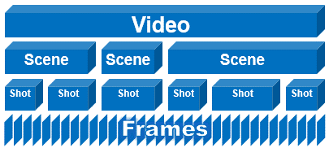
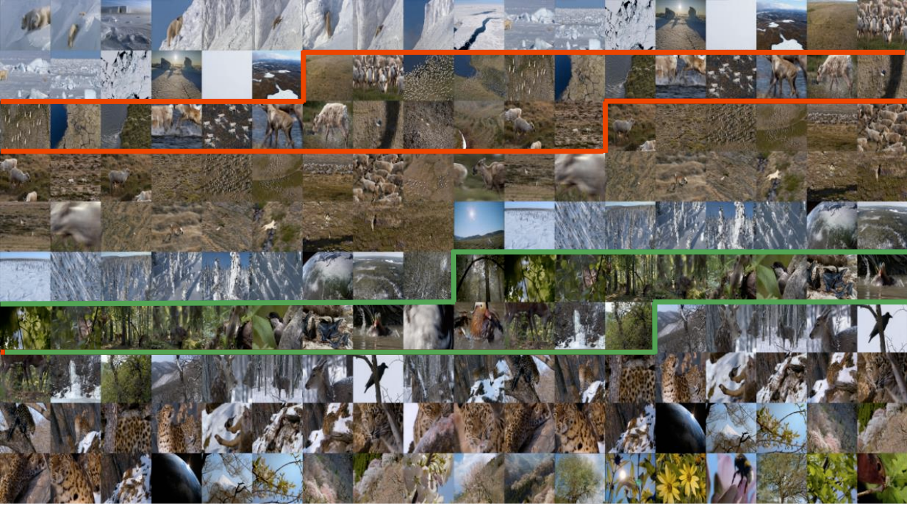

## Week 1 - Community Bonding + Research
Upon input from my mentors, I decided to look into Shot Boundary Detection and Scene boundary detection. Week-1 was mostly to get familiar with the project so, not much code was written during this week.  
### Shot Boundary Detection (SBD):
Shot boundary detection is a computer vision method to segment a video based on different shots present in it. A shot can be thought of as a single stretch of recording from the same camera angle. So in the video if the camera shifts/cuts to a different person, the algorithm would consider that as a boundary.  

<a href="https://github.com/Breakthrough/PySceneDetect">PySceneDetect</a> is an opensourced shot boundary detection python library that takes a video file as an input and gives all the shots in it. I tried it on a <a href="https://streamable.com/owxw9">short video clip</a> cut out from an 8 hour video. <a href="https://pastebin.com/HB5LNAr9">Here</a> are the sample results.  

### Scene Boundary Detection (ScBD):
A scene is a segment in a video with the same theme/background/topic going on. Each scene can contain multiple shots (as long as the content covered by these shots is visually similar). Compared to SBD, ScBD is way more complicated and often uses deep learning to segment scenes. 

One of the research papers I was referred to for ScBD was <a href="https://ieeexplore.ieee.org/document/7177476">Scene Segmentation using Temporal Clustering</a>. The basic gist of the paper is to identify various shots in the video first using SBD, then cluster these shots temporally. This means that we have to 'link' consecutive shots based on their visual/contextual similarity. Doing this was my plan going on to week 2.
