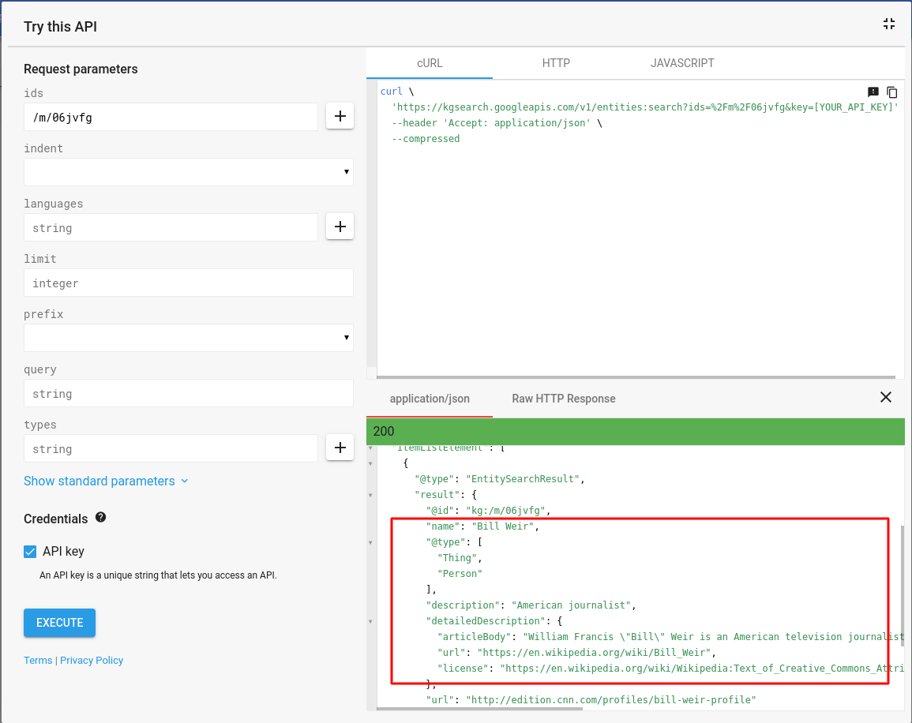

## Week 10,11,12 - MSCeleb Classification and Wrapping up
Weeks 10,11 & 12, I spent almost a week getting familiar with RedHen's cluster and setting up my required python environment on it. Lot of time was also spent on finding a copy of the MSCeleb dataset. A torrent to this can be found <a href="https://academictorrents.com/details/9e67eb7cc23c9417f39778a8e06cca5e26196a97/tech&hit=1&filelist=1">here</a>.<br>
The dataset came as a bunch of .tsv files, the process of extracting this dataset into directories of .jpg files took around 40 hours on the cluster.

The names of the directories were <a href="https://www.wikidata.org/wiki/Property:P646">Freebase IDs</a>, so I used <a href="https://developers.google.com/knowledge-graph/">Google Knowledge Graph Search API</a> to extract names of all the celebrities.


 The API also returned a description field for each celebrity. Since we only need to identify TV hosts/anchors for our use-case, I filtered out celebrities who have the following words in their description:
* host
* anchor
* broadcaster
* reporter
* television personality
* news


and was left with around 15000 celebrities. I used the 
face_recognition library to extract encodings for all images of these celebrities and pickled these encodings into a <a href="https://drive.google.com/file/d/1AAkCoH1FDuJz4pTOyZv9QCUFPZAHECRI/view">file</a>.

To identify celebrities:
* Load the pickle into a python variable.

```python
celebs, celeb_encodings = loadPickle('final_celeb_detection/final_pickles/anchors-with-TV-encodings.pickle')
celeb_encodings = np.array([np.array(x) for x in celeb_encodings])
```

* Create an instance of sklearn's KNeighborsClassifier.

```python
# Populating KNN space with labelled encodings
X = []
Y = []
for i in range(len(celeb_encodings)): #prepare dataset
    for celeb_encoding in celeb_encodings[i]:
        X.append(celeb_encoding)
        Y.append(celebs[i])
    
neigh = KNeighborsClassifier(n_neighbors=30)
```
* Fit the classifier on this dataset of encodings.

```python
neigh.fit(X, Y)
```

* Get encodings of the face and pass it through the predict function of the classifier to get a list of predictions.

```python
def encoding2name(f_encodings):
        return neigh.predict(f_encodings)
```

* The majority predicted celebrity class is taken as the required celebrity's name.
 
Go through <a href="https://github.com/eonr/ShowSegmentation/blob/master/final_usable_code/celebDetect.py">celebDetect.py</a> for more information.<br><br>
I should also mention that the publicly available MS-Celeb dataset only contains 100,000 celebrities, whereas the dataset that Azure works on has almost a million celebrities. So if one is able to use Azure, he/she should always opt for that over this.

I spent the following week preparing the output format according to RedHenLab's requirement and creating a <a href="https://singularity.lbl.gov/">Singularity container</a> so that the project can be run anywhere without environment conflicts.

### Future work:
Some things we couldn't finish before the deadline that could be worked on in the future:
1. Explore subtitle analysis to identify anchor/show names.
2. Using IMDb dataset to identify show names from anchors' names (identified using MSCeleb).
3. If possible, replace the current celeb detection method with Azure's Computer Vision service.
4. Currently the most time consuming process in the program is that of going frame by frame and extracting faces. This can be sped up using multi-threading or any other means possible.


All in all, this has been a great learning experience for me. I'd like to thank my mentors at RedHenLab for this opportunity and for guiding me through the project. Thank you for reading.
