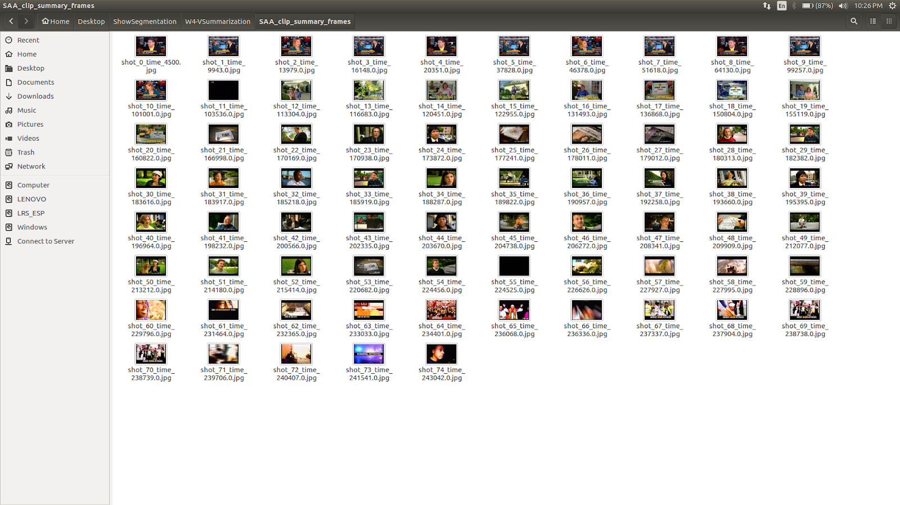

## Week 4 - Video Summarization for Keyframes
Ideally, keyframes are the frames which best represent the shot i.e., contain the maximum information about the shot that a single frame can contain. The thumbnail of a video can be thought of as its keyframe, and this is one of the original motives behind Video Summarization techniques. 
We've been using the middle frame of a shot as its keyframe but obviously this is not always the frame that best represents the shot and hence we decided to use Video Summarization to get better key frames. 

### VASNet
After looking at a bunch of open-sourced implementations, I decided to use <a href="https://github.com/ok1zjf/VASNet">VASNet</a> as its pre-trained model is available online. 
The outline of the procedure is as follows:
* The input video is first subsampled to 2 FPS.
* Each frame is passed through GoogleNet for feature extraction.
* We prepare a list of features for each shot and this list is passed through the customized VASNet algorithm which outputs an 'importance' metric for each frame. 
* The frame with the most 'importance' is taken as the keyframe of that shot.

  The results didn't show much improvement so we put a pause on the whole temporal clustering/ SBD/ ScBD methodology and decided to explore facial and other information present in the video.