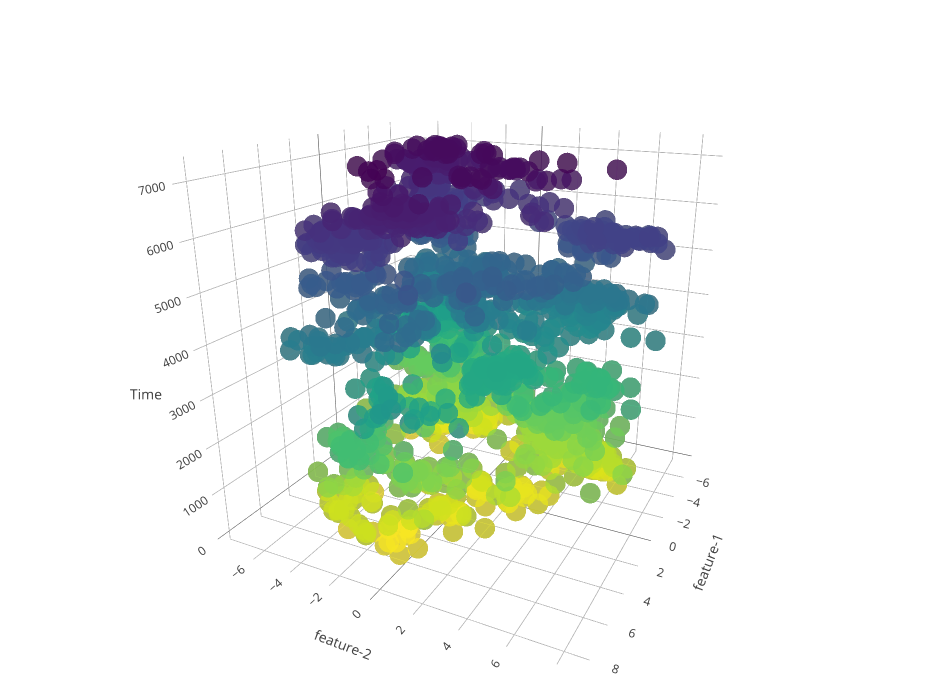
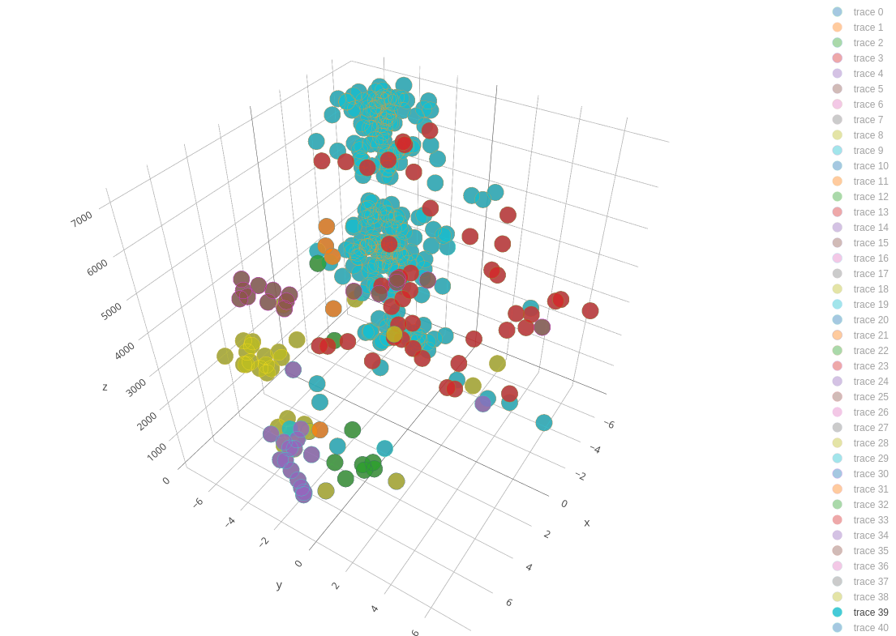
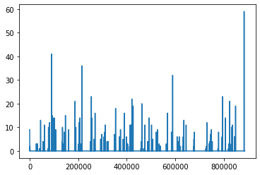

## Week 5 - Face clustering
Back in week 3, we wrote code to extract all faces present in the video using <a href="https://github.com/ageitgey/face_recognition">face_recognition</a> , and store them in a temporally sorted manner in a directory. This week, we tried to cluster these faces and visualize them using plotly. We also try to draw inference from presence of black frames in the video.
 

### Face clusters visualization
I used a total of 3 videos of different sizes to plot with. In the filename, ‘SAA’ indicates a video of length 4.5 minutes. ‘2006-2hours’ is of 2 hours and ‘2006-8hours’ is a little over 8 hours. Obviously, longer videos have more recognized faces and hence more blobs/markers in the plot. I clustered all these faces using the <a href="https://github.com/elcorto/imagecluster">Imagecluster</a>  library discussed in week-3 and plotted them interactively using <a href="https://plot.ly/python/3d-scatter-plots/">plotly</a>.  I used PCA to convert each image's features to 2 dimensions to make it easier to plot. In the following 3D plots, the x & y axes represent these two features of an image and the z-axis represents the time.
1. Colored according to time - In the plot, lighter(yellow) markers represent faces recognized earlier in the video and darker(purple) markers represent those found later.

   *  <a href="https://plot.ly/~eonr/6/">SAA-time-colored plot</a>
   *  <a href="https://plot.ly/~eonr/4/">2006-2hours-time-colored plot</a>
   *  <a href="https://plot.ly/~eonr/2/">2006-8hours-time-colored plot</a>
2. Colored according to class - I decided to give all markers(faces) of the same class(person) the same color. On the right side of the plot, is a legend of clusters(traces). Clicking on a cluster enables/disables its display on the plot. (Always have more than 1 cluster showing on the plot, as it scales automatically depending on what is being displayed)

   * <a href="https://plot.ly/~eonr/8/">SAA-person-colored plot</a>
   * <a href="https://plot.ly/~eonr/10/">2006-2hours-person-colored plot</a>

3. This time, I plotted the 2 features on a 2D plot, with the x axis representing time and the y axis representing the value of the feature. Each class has 2 traces in the plot, feature-1 and feature-2 consecutively. 
   * <a href="https://plot.ly/~eonr/12/feature-1-feature-2-feature-1-feature-2-feature-1-feature-2-feature-1-feature-2-/">2006-2hours-2DScatter</a>

#### <b>Inference</b>: 
<b>The words <i>anchor</i> and <i>host</i> are used interchangeably</b> 
The main motive of the whole face-extraction-clustering process was always to find the anchor(s) of shows. Almost all shows (in our dataset) have one or more anchors/hosts associated with them. If we could somehow identify these hosts, we could say that the point in the video where the host first appears is roughly the start of the show and where he last appears is roughly the end of that show.  
We as humans, can look at a show with multiple people in it and tell with certainty which of these people is the host. So there must be some way in which we could make an algorithm do it for us as well.  
From the plots, I tried to identify what makes a host/anchor unique from someone thats not.  
* The most important point is that the host is not necessarily someone that has the most screen-time, but appears evenly distributed throughout the show. His/her's temporal distribution would be roughly evenly distributed throughout the duration of the show.
* First/last appearances of the host are very close to the start/end of the show.
  
Now, the task is how to separate out the host in code i.e., using an algorithm. This is what I'd worked on for the next couple of weeks and will be discussed there. 

### Black Frames
For the project, I watched (not entirely) an 8 hour video of CNN aired on the new year of 2006 a few times. One thing I noticed was the flashing of raw black frames in the video. These black frames lasted for a very short time, often less than half a second and showed up in between shows, before/after advertisements etc. So, the presence of black frames almost always indicated a boundary but not decisively the type of the boundary, the types being:
* Show-Advertisement
* Advertisement-Advertisement
* Advertisement-Show
* Show-Show (rarely)

We never really went ahead with this method, but I believe there's definitely something to be inferred from this information. 

The <a href="https://github.com/elcorto/imagecluster">Imagecluster</a> library worked well when clustering frames but is certainly not the best when clustering faces. So in the following weeks, we implement a custom face-clustering algorithm using the <a href="https://github.com/ageitgey/face_recognition">face_recognition</a> library and Density Based Clustering, and also try to find hosts of shows from the clustering results.